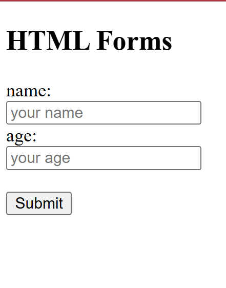
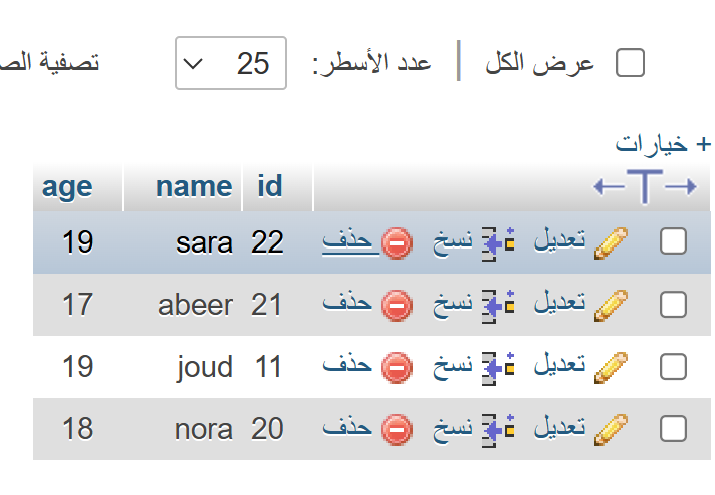

# HTML, PHP & MySQL Form Project

## Project Description
This project is a simple web application developed using HTML and PHP with a MySQL database. It allows users to enter their name and age through a web form, stores the submitted data in the database, and displays all saved records in a table.

## Technologies Used
- HTML
- PHP
- MySQL

## Project Files
- `y.html` – Contains the HTML form for entering user information.
- `n.php` – Receives the submitted data and inserts it into the MySQL database.
- `DB.php` – Connects to the database and displays all stored records.

## Steps

### Step 1: Create the HTML Form
A simple HTML form was created with:
- Name field
- Age field
- Submit button

The form sends the data using the GET method to `n.php`.

### Step 2: Connect to the Database
A MySQL database connection was established using PHP with the following information:
- Server Name
- Username
- Password
- Database Name

### Step 3: Insert Data
The submitted name and age are retrieved using the `$_GET` method and inserted into the `user` table using an SQL `INSERT` statement.

### Step 4: Display Data
The stored records are retrieved from the database using an SQL `SELECT` statement and displayed in an HTML table.

## How to Run the Project
1. Upload the project files to the web server.
2. Create the MySQL database and the `user` table.
3. Open `y.html` in the browser.
4. Enter a name and age.
5. Click **Submit**.
6. The data will be stored in the database and displayed on the page.

## Output
The application allows users to:
- Enter their information.
- Save the information into the MySQL database.
- View all stored records in a table.

## Live Demo

- Form: https://ath.free.je/y.html
- View Records: https://ath.free.je/DB.php

  ## Screenshots

### Input Form

### Database Records

